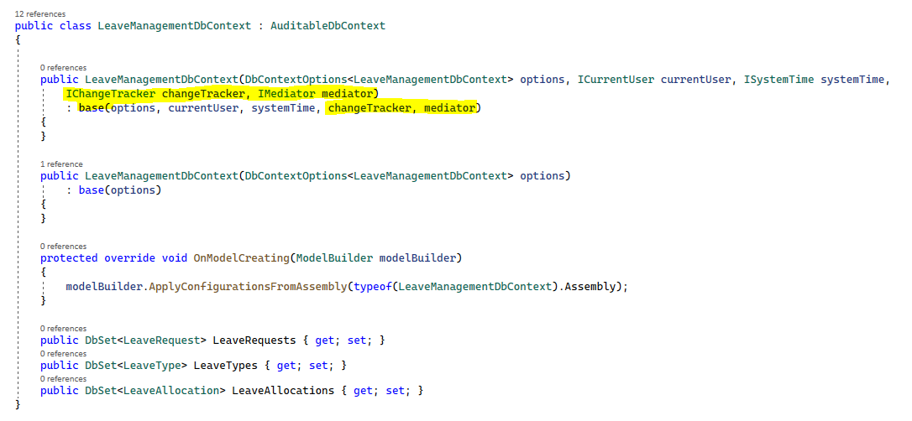

# 1.0.1.75

This represents our initial public release of RCommon. It's been a long road to get here. The first development of RCommon began as a private effort which was initially forked from NCommon circa 2010. We quickly found out that the NCommon project was abandoned and the number of enhancements grew to the point where we knew that this needed to be its own project. And so RCommon was born in a private Team Foundation Server repository in 2013.&#x20;

RCommon spent 7 years in production across many different projects but received very few updates other than was what required to keep dependencies up to date. In 2020, [Jason Webb](https://jasonwebb.net) brought the project into GitHub and began making substantial updates to bring it up to date. First with migrating to .NET Core (and eventually to .NET 6), enhancing/hardening existing functionality, and then adding some desperately needed new features.&#x20;

Over the next couple of years, we've brought the RCommon project up to a relatively strong level of quality and that all culminates with this release.&#x20;

## Release Notes

* Major features are described as part of this website's documentation, so we won't reiterate it here.&#x20;

### Breaking Changes

It seems funny that there would be breaking changes from an initial release, but again, this software has been around a while in a production environment - while technically in a "Beta" version if you've been following along with GitHub releases. Alas, there are some breaking changes going from the "Beta" version to this production level version.&#x20;

#### Fluent Dependency Injection Interface

* Minor changes in EF Core configuration within persistence interface. Ultimately, we wanted a better options interface for EF Core that aligned better with how developers currently configure EF DbContextOptions.&#x20;
* We re-worked the Dapper configuration interface which allows for a DBFactory to decide on the Client for the SQL implementation (SQL Server vs. MySql vs. Postgres, etc.)
* The RCommon.Configuration namespace is no longer used. Only RCommon namespace should be used for fluent DI configuration.&#x20;

#### IDataStore Implementations Require Additional Interfaces Injected

* Due to how the Unit of Work and Distributed Unit of Work behaves in conjunction with event dispatching, we ultimately felt that implementations of [IDataStore ](https://github.com/RCommon-Team/RCommon/blob/main/Src/RCommon.DataServices/IDataStore.cs)([`RDbContext`](https://github.com/RCommon-Team/RCommon/blob/main/Src/RCommon.Persistence.EfCore/RCommonDbContext.cs), and [RDbConnection](https://github.com/RCommon-Team/RCommon/blob/main/Src/RCommon.DataServices/Sql/RDbConnection.cs)) is the lowest common denominator for where persistence occurs. By extension, it also felt right to have local events dispatched from the "PersistChanges" method in those implementations rather than the respective repository. As of result of this, [IChangeTracker](https://github.com/RCommon-Team/RCommon/blob/main/Src/RCommon.BusinessEntities/IChangeTracker.cs), and IMediator need to be injected into the IDataStore implementations constructors.&#x20;

Example:

