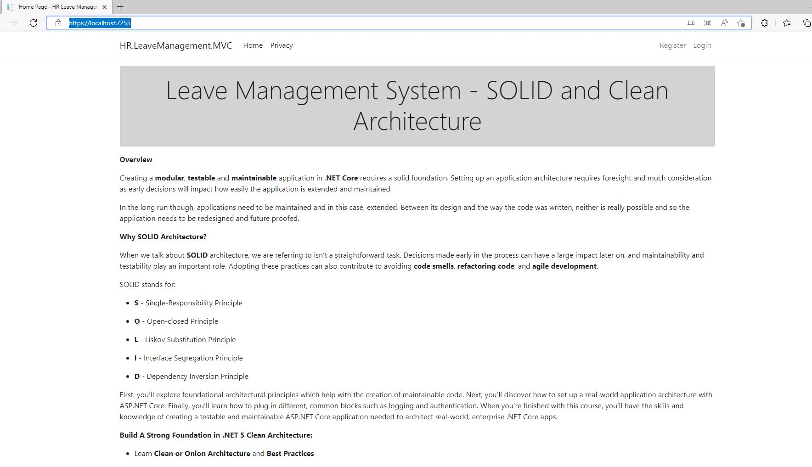

# Running Samples

## Requirements

* Visual Studio 2019 Community Edition+
* SQL Express 2019+
* Requires EF Tools to be installed to dotnet CLI [https://docs.microsoft.com/en-us/ef/core/cli/dotnet](https://docs.microsoft.com/en-us/ef/core/cli/dotnet) - include updates.

### Suggested Reading & Courseware

There is a lot to do with RCommon. It can be used simply as a library of extensions/helpers to assist you with day-to-day programming, or you can build substantially complicated solutions from it. Our samples will focus on some of the heavier lifting done when building loosely coupled, future proofed applications.&#x20;

Our "Clean Architecture with CQRS" sample was built from an [existing educational solution](https://github.com/trevoirwilliams/HR.LeaveManagement.CleanArchitecture-dotnet5) which also happens to have a [Udemy course ](https://www.udemy.com/course/aspnet-core-solid-and-clean-architecture-net-5-and-up/)available for it. We don't have anything to do with the courseware but we like it. This is a good place to start as it will provide a straight forward approach to building a loosely coupled application using patterns like CQRS, Mediator, Unit of Work, Repository Pattern, and more. RCommon extends this sample by demonstrating how easy, and efficient it is to use our persistence libraries along with our data services to implement unit of work.&#x20;

### Start Up Instructions

1. Right click on the HR.LeaveManagement.API project
2. Choose "Open in Terminal" from menu
3. Refer to Developer Powershell
4. Run commands below:
   * dotnet ef database update --context LeaveManagementDbContext
   * dotnet ef database update --context LeaveManagementIdentityDbContext
5. Right click solution and choose "Set Startup Projects" from menu.
6. Choose "HR.LeaveManagement.MVC" and "HR.LeaveManagement.API" from menu options.
7. Build and Start Solution

### Login

At this point you should have a solution that compiles, and runs and you'll be presented with two browser windows:

1. The Swagger API for the HR Leave Management System
2. The User Interface for the HR Leave Management System

3\. Choose the "Login" link at the top right

4\. Login with "admin@localhost.com" and Password: "P@ssword1" for administrative functionality and "user@localhost.com"/"P@ssword1" for a basic user functionality

5\. From here, you can feel free to explore the application.&#x20;
