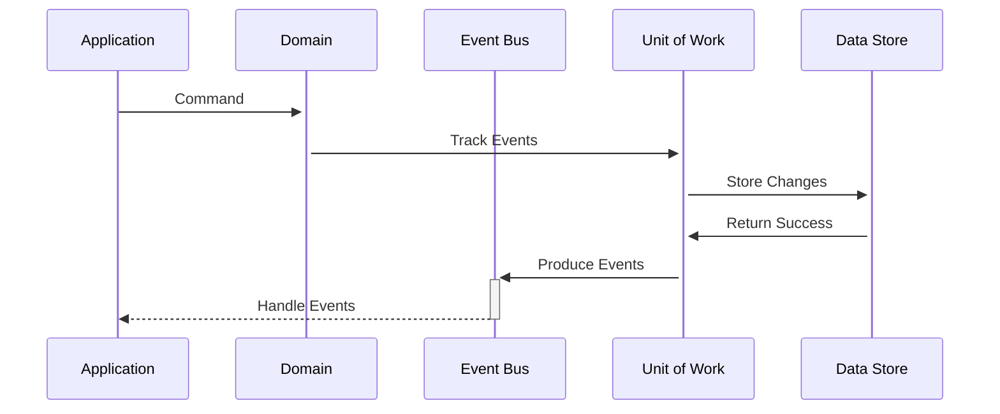

# Transactional Events

### Overview

Transactional events (aka Deferred events) are events which are intentionally withheld from being raised until the application is ready to produce the events. A typical reason for using transactional events is that some application logic (often persistence) needs to successfully occur before the events are produced. This is especially useful when distributed systems are being utilized as we would not want to send a distributed event out to another subsystem unless we were sure that our application's state is reliably accurate.

### Mechanics of Transactional Events

There are a variety of patterns that are useful for implementing transactional events including [unit of work](../../patterns/persistence/transactions/unit-of-work.md) and [persistence ](../../patterns/persistence/)via [repositories](../../patterns/persistence/repository/). RCommon keeps the responsibility of routing events in "IEventRouter" implementations. The default implementation of IEventRouter is the "InMemoryTransactionalEventRouter" which uses a scoped non-durable in-memory collection to track events until you are ready to route them to your [registered event producers](producers.md). There is logic within the default event router implementation which handles asynchronous events and synchronous events
