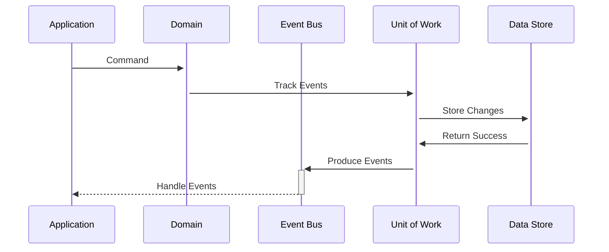

# Transactional Events

### Overview

Transactional events (aka Deferred events) are events which are persisted to a data store and held in a queue until some criteria of your application has been met. When the target criteria has been met, then a mechanism notifies the queue that it should send out all the events to their subscribers.&#x20;

