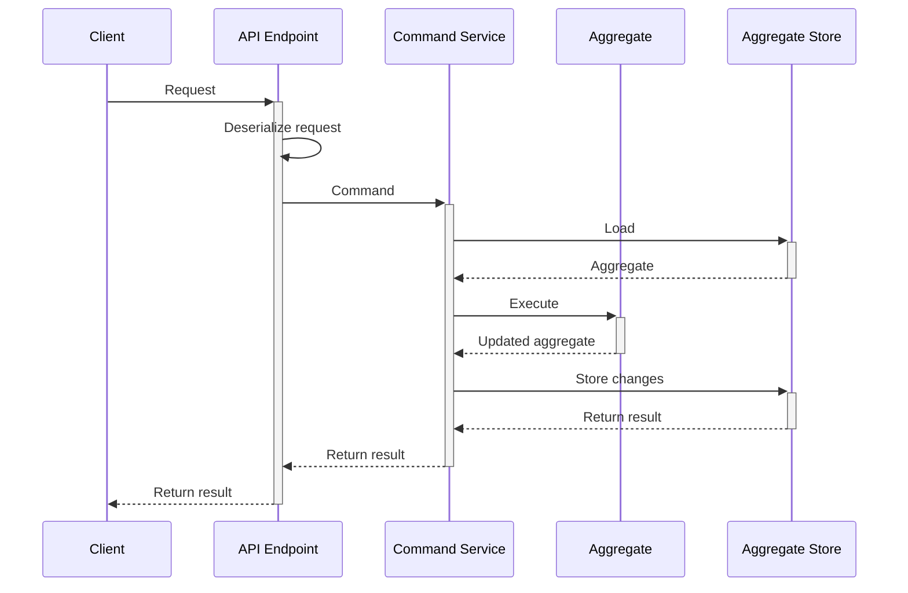

# Commands

```mermaid
sequenceDiagram
    participant Client
    participant API Endpoint
    participant Command Service
    participant Aggregate
    participant Aggregate Store

    Client->>+API Endpoint: Request
    API Endpoint->>API Endpoint: Deserialize request
    API Endpoint->>+Command Service: Command
    Command Service->>+Aggregate Store: Load
    Aggregate Store-->>-Command Service: Aggregate
    Command Service->>+Aggregate: Execute
    Aggregate-->>-Command Service: Updated aggregate
    Command Service->>+Aggregate Store: Store changes
    Aggregate Store-->>-Command Service: Return result
    Command Service-->>-API Endpoint: Return result
    API Endpoint-->>-Client: Return result

```
