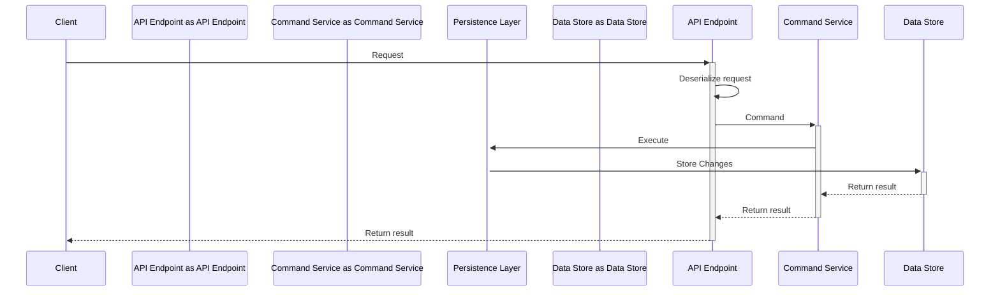

# Commands

```mermaid
sequenceDiagram
  participant Client as Client
  participant API Endpoint as API Endpoint
  participant Command Service as Command Service
  participant Persistence as Persistence Layer
  participant Data Store as Data Store

  Client ->>+ API Endpoint: Request
  API Endpoint ->> API Endpoint: Deserialize request
  API Endpoint ->>+ Command Service: Command
  Command Service ->>+ Persistence: Execute
   Persistence ->>+ Data Store: Store Changes
  Data Store -->>- Command Service: Return result
  Command Service -->>- API Endpoint: Return result
  API Endpoint -->>- Client: Return result

```
