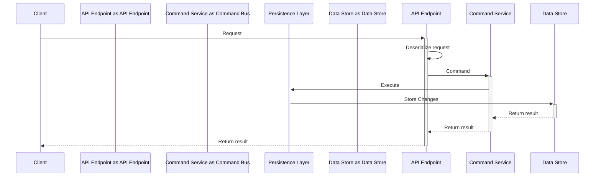

# Commands

### Overview

### Mechanics of a Command in CQRS

#### Command

Coming soon...

#### Command Validation

Coming soon...

#### Command Bus

Coming soon...

#### Command Handler

Coming soon...

### Putting It All Together

Coming soon...

### Examples


[cqrs.md](../../../examples/cqrs.md)



[clean-architecture.md](../../../examples/clean-architecture.md)

