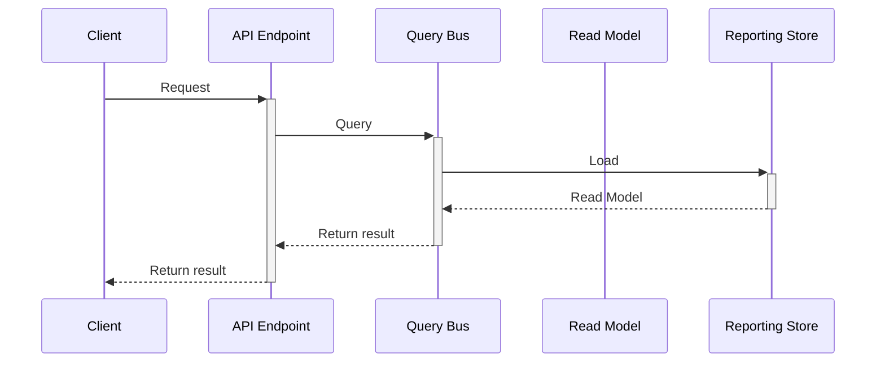

# Queries

### Overview

### Mechanics of a Query in CQRS

#### Query

Coming soon...

#### Query Validation

Coming soon...

#### Query Bus

Coming soon...

#### Query Handler

Coming soon...

### Putting It All Together

Coming soon...

### Examples


[cqrs.md](../../../examples/cqrs.md)



[clean-architecture.md](../../../examples/clean-architecture.md)

