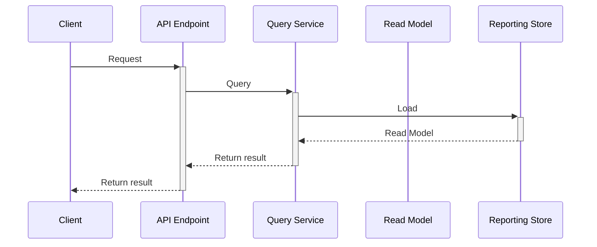

# Queries

```mermaid
sequenceDiagram
    participant Client
    participant API Endpoint
    participant Query Service
    participant Read Model
    participant Reporting Store

    Client->>+API Endpoint: Request
    API Endpoint->>+Query Service: Query
    Query Service->>+Reporting Store: Load
    Reporting Store-->>-Query Service: Read Model
    Query Service-->>-API Endpoint: Return result
    API Endpoint-->>-Client: Return result
```
